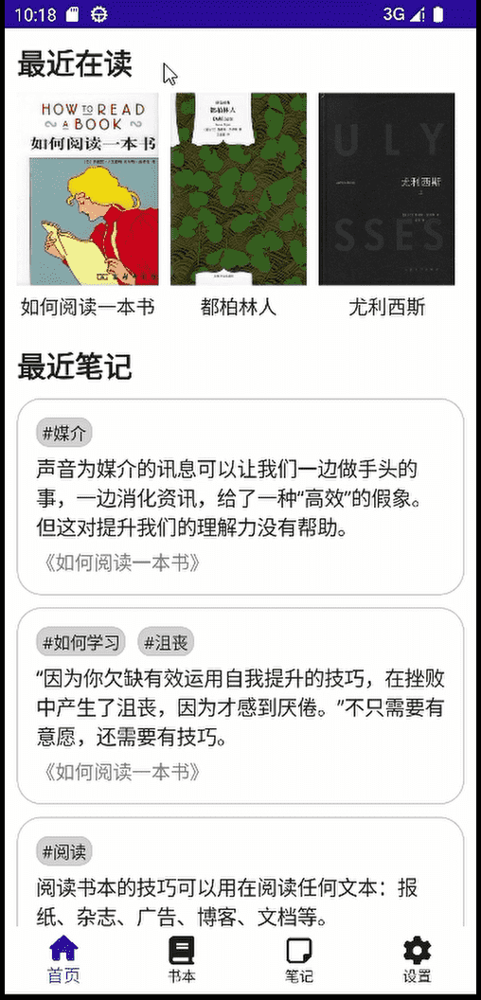
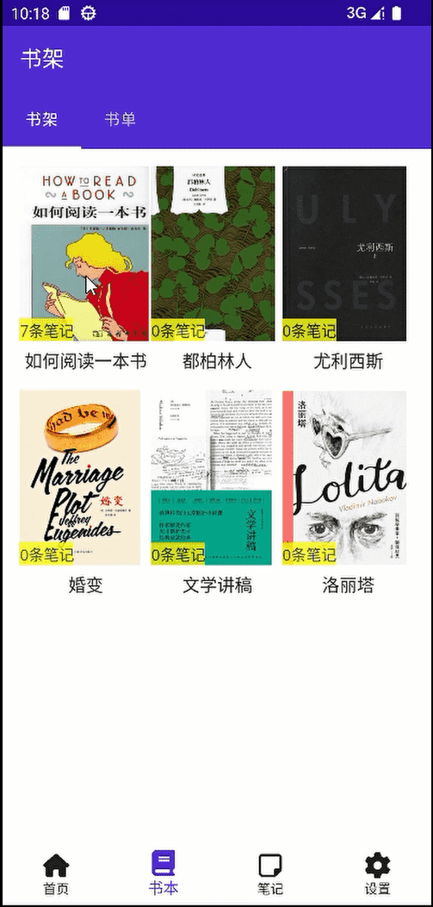
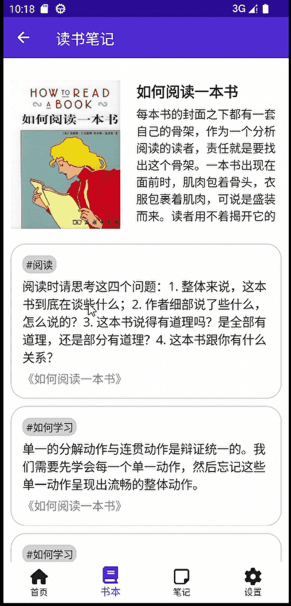
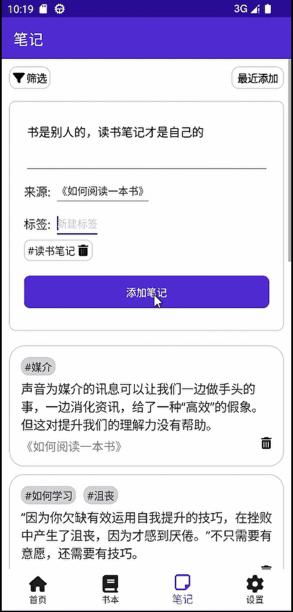

# 读书笔记App

无论出于哪个时代，阅读都是增进智慧的重要途径。“书是别人的，读书笔记才是自己的”，用文字记录读书的心得，可以加深对书本的理解。为此，我开发了读书笔记App原型，它支持以下功能：

- 添加图书（待实现）
- 记录读书笔记
- 为笔记添加标签

## 技术栈

本项目包含移动端和后端，均使用 .NET 完成。具体技术如下：

- .NET MAUI
- MVVM模式
- ASP.NET Minimal API
- Entity Framework

## 运行项目

### 启动后端服务
```shell
$ cd Service/ReadingNoteAppService
$ dotnet watch # 启动后端服务
```

### 启动移动端

使用 Visual Studio 打开 `Mobile\Mobile.sln`，并运行项目。

## 项目预览

首页



书架页



书籍详情页



笔记页

